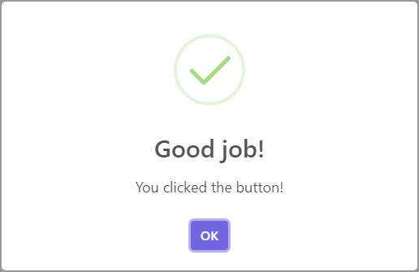
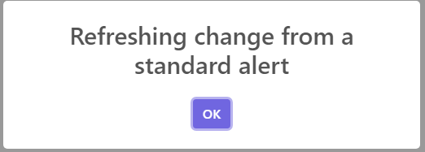
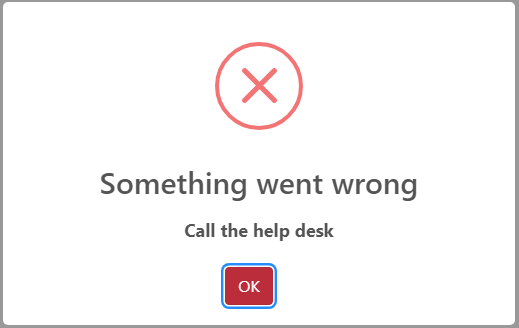
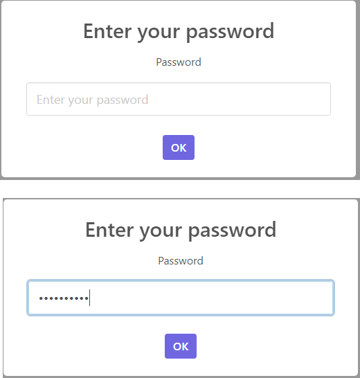
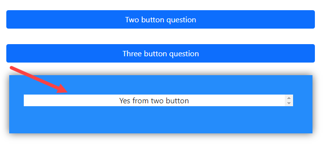
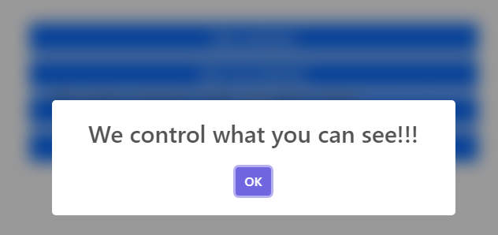
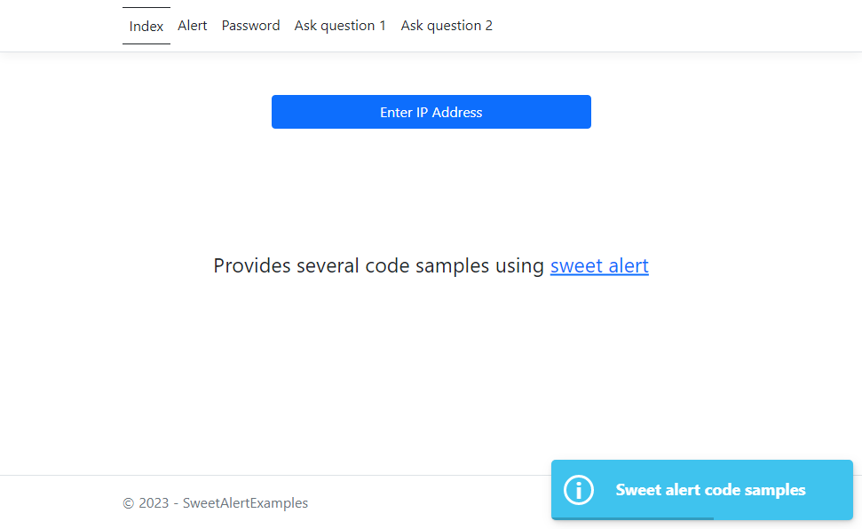

# Using sweetalert2 for ASP.NET Core/Razor Pages

[Sweetalert2](https://sweetalert2.github.io/) is a customizable, accessible `WAI-ARIA` alternative to JavaScript and BootStrap dialogs.

Concerning `WAI-ARIA`, with little effort any web application exposed to the public or for a internal team/group can benefit by applying [WCAG AA](https://www.w3.org/WAI/WCAG2AA-Conformance) rules. With a default web browser alert, AA conformance is a null point.

## Configuration

- Include in your project
    - [sweetalert2.min.js](https://cdnjs.cloudflare.com/ajax/libs/limonte-sweetalert2/11.7.5/sweetalert2.min.js)
    - [sweetalert2.css](https://cdnjs.cloudflare.com/ajax/libs/limonte-sweetalert2/11.7.5/sweetalert2.css)

## Basic alert with some animation



Frontend 

To display an alert pop-up where the checkbox image is animated and centered.


```html
<form method="post" id="form1" class="mt-5">

    <div class="d-grid gap-2 col-6 mx-auto">

        <div class="row">
            <button type="button"
                    id="showAlert1"
                    class="btn btn-primary">
                Basic alert
            </button>
        </div>

    </div>

</form>
```

**JavaScript** Backend code

```javascript
document.getElementById('showAlert').addEventListener("click", function () {
    Swal.fire(
        'Good job!',
        'You clicked the button!',
        'success'
    );
});
```

## Basic alert with no animation



Frontend

```html
<div class="row">
    <button type="button"
            id="showAlert2"
            class="btn btn-primary">
        Basic not animated
    </button>
</div>
```

**JavaScript** Backend code

```javascript
document.getElementById('showAlert2').addEventListener("click", function () {
    Swal.fire('Refreshing change from a standard alert ');
});
```

> **Note**
> In both examples above the user can click outside of the dialog which closes the dialog. The next example disallows closing the dialog by clicking outside the dialog.

## Alert true modal



Frontend code

```html
<div class="row">
    <button type="button"
            id="showAlert3"
            class="btn btn-primary">
        Modal
    </button>
</div>
```

Backend code

- The key to disallowing closing the alert by clicking outside the alert is `allowOutsideClick: false`
- Notes 
    - `btn btn-danger` for styling the button
    - `html` to use html else if no html use `text` instead.

```javascript
    document.getElementById('showAlert3').addEventListener("click", function () {
        const swalWithBootstrapButtons = Swal.mixin({
            customClass: {
                confirmButton: 'btn btn-danger'
            },
            buttonsStyling: false
        });

        swalWithBootstrapButtons.fire({
            title: 'Something went wrong',
            html: "<strong>Call the help desk</strong>",
            icon: 'error',
            allowOutsideClick: false,
            allowEscapeKey: false,
            reverseButtons: true
        });
    });
```

## User input/password



Frontend code

```html
<form method="post" id="form1" class="mt-5">
    <div class="d-grid gap-2 col-6 mx-auto">

        <input type="hidden" asp-for="Password" id="_password" />
            
        <div class="row">
            <button type="button" id="getPassword" class="btn btn-primary">Enter password</button>
        </div>
            
    </div>
        
</form>
```

**JavaScript** Backend code

```javascript
function GetPassword() {
    (async () => {

        const { value: password } = await Swal.fire({
            title: 'Enter your password',
            input: 'password',
            inputLabel: 'Password',
            inputPlaceholder: 'Enter your password',
            inputAttributes: {
                maxlength: 10,
                autocapitalize: 'off',
                autocorrect: 'off'
            }
        })

        if (password) {
            $("#_password").val(password);
            $("#form1").submit(); 
        }

    })();
}
```

**C#** Backend code

Which in this case uses SeriLog to log to the console window

```csharp
public class PasswordPageModel : PageModel
{
    [BindProperty]
    public string? Password { get; set; }
    public void OnGet()
    {
    }

    public void OnPost()
    {
        Log.Information("Password: {P1}", Password);
    }
}
```

## Ask a question

In the project, page ConfirmationPage a special JavaScript class is used to see results from JavaScript without opening developer tools. for more information see [Readme](SweetAlertExamples/wwwroot/js/kendo/readme.md) under wwwroot.



Frontend code mixed with JavaScript

```html
<script language="javascript" src="js/SweetDialogs.js"></script>
<link href="lib/kendo/kendoConsole.css" />

<div class="container">

    <form method="post" id="form1" class="mt-5">

        <div class="d-grid gap-2 col-6 mx-auto">

            <input type="hidden" asp-for="Confirmation" id="_confirmation" />
            <input type="hidden" asp-for="ThreeButton" id="_confirmation1" />
            <input type="hidden" asp-for="Which" id="_which" />

            <input type="button" 
                   class="btn btn-primary mt-lg-4" 
                   value="Two button question" 
                   id="confirmLink"/>
            <input type="button" 
                   class="btn btn-primary mt-lg-4" 
                   value="Three button question" 
                   id="confirm"/>
                   
            @*Kendo*@
            <input type="hidden" 
                   asp-for="Results" 
                   id="_resultItem" 
                   class="border-0" />

        </div>

    </form>
    
    @*Kendo*@
    <div class="row">
        <div class="well-container">
            <div class="col text-center">
                <div class="console" style="overflow-y: scroll; "></div>
            </div>
        </div>
    </div>

    <div class="container-fluid d-flex justify-content-center align-items-center" 
         style="overflow:hidden;">
        <div class="row text-center d-flex align-items-center"
             style="overflow: hidden; width: 25vw; height: 25vh;">

            <div class="card">
                <div class="card-header">
                    Questions and kendo console
                </div>
                <div class="card-body">

                    <p class="card-text">
                        This page uses a special console window from 
                        <a href="https://www.telerik.com/" target="_blank">telerik</a>
                    </p>
                    <p>See <span class="text-success">
                        kendoConsole.js
                    </span> under wwwroot/js/kendo</p>
                    <a class="btn btn-primary" asp-area="" asp-page="/Index">Home</a>
                </div>
            </div>

        </div>
    </div>
</div>


@section scripts{

    <script type="text/javascript" src="js/kendo/kenoConsole.js"></script>

    <script>

        $(document).ready(function () {
            var resultItem = $('#_resultItem').val();
            if (typeof (resultItem) !== 'undefined' && resultItem.length > 0) {
                kendoConsole.log($("#_resultItem").val());
            } else {
                kendoConsole.log('ready');
            }
        });

        document.getElementById("confirmLink").addEventListener("click", function () {
            $("#_which").val(2);
            $SweetDialogs.TwoButtonQuestion();
        });

        document.getElementById("confirm").addEventListener("click", function() {
            $("#_which").val(1);
            $SweetDialogs.ThreeButtonQuestion();
        });

    </script>
}
```

**JavaScript** Backend code

**DO NOT** copy this code into another project with no modifications as there are hooks into the frontend e.g. element identifiers which are easy enough to change.

```javascript
var $SweetDialogs = $SweetDialogs || {};
$SweetDialogs = function () {
    var ThreeButtonQuestion = function () {
        GetConfirmationThreeButtons();
    };

    var TwoButtonQuestion = function () {
        GetConfirmation();
    };

    function GetConfirmationThreeButtons() {
        (async () => {

            const swalWithBootstrapButtons = Swal.mixin({
                customClass: {
                    confirmButton: 'btn btn-success',
                    denyButton: 'btn btn-primary',
                    cancelButton: 'btn btn-danger'
                },
                buttonsStyling: false
            });

            swalWithBootstrapButtons.fire({
                title: 'Do you want to save the changes?',
                showDenyButton: true,
                showCancelButton: true,
                confirmButtonText: 'Save',
                denyButtonText: `Don't save`,
                allowOutsideClick: false,
            }).then((result) => {
                if (result.isConfirmed) {
                    $("#_confirmation1").val(1);
                    document.getElementById("_resultItem").setAttribute('value', 'Confirmed from three buttons');
                    document.getElementById("form1").submit();
                } else if (result.isDenied) {
                    $("#_confirmation1").val(2);
                    document.getElementById("_resultItem").setAttribute('value', 'do not save from three buttons');
                    document.getElementById("form1").submit();
                } else {
                    $("#_confirmation1").val(3);
                    document.getElementById("_resultItem").setAttribute('value', 'Cancel from three buttons');
                    document.getElementById("form1").submit();
                }
            });
        })();
    };
    function GetConfirmation() {
        (async () => {

            const swalWithBootstrapButtons = Swal.mixin({
                customClass: {
                    confirmButton: 'btn btn-danger',
                    cancelButton: 'btn btn-primary'
                },
                buttonsStyling: false
            });

            swalWithBootstrapButtons.fire({
                title: 'Are you sure?',
                html: "You <strong>won't</strong> be able to revert this!",
                //icon: 'warning',
                showCancelButton: true,
                confirmButtonText: 'Yes, delete it!',
                cancelButtonText: 'No, cancel!',
                allowOutsideClick: false,
            }).then((result) => {
                if (result.isConfirmed) {
                    $("#_confirmation").val(true);
                    document.getElementById("_resultItem").setAttribute('value', 'Yes from two button');
                    document.getElementById("form1").submit();
                } else if (result.isDismissed) {
                    $("#_confirmation").val(false);
                    document.getElementById("_resultItem").setAttribute('value', 'No from two button');
                    document.getElementById("form1").submit();
                } else if (result.dismiss === Swal.DismissReason.cancel) {
                    $("#_confirmation").val(false);
                    document.getElementById("form1").submit();
                }
            });
        })();
    };
    return {
        ThreeButtonQuestion: ThreeButtonQuestion,
        TwoButtonQuestion: TwoButtonQuestion
    };
}();
```

**C#** Code

Easy to following code. The property `Which` assist in the post event to know who posted, the two button or three button dialog
Easy to following code. The property `Which` assist in the post event to know who posted, the two button or three button dialog.

```csharp
public class ConfirmationPageModel : PageModel
{
    [BindProperty]
    public bool Confirmation { get; set; }

    [BindProperty]
    public int ThreeButton { get; set; }

    [BindProperty]
    public string Results { get; set; }

    [BindProperty]
    public int Which { get; set; }

    public void OnGet()
    {
    }

    public void OnPost()
    {

        if (Which == 1)
        {
            /*
             * Three button dialog result
             */
            Confirmations confirmation = (Confirmations)ThreeButton;
            Log.Information("ThreeButton {P1} Enum {P2}", 
                ThreeButton, 
                confirmation);
        }
        else
        {
            /*
             * Two button result
             */
            if (Confirmation)
            {
                Log.Information("Two button Delete stuff");
            }
            else
            {
                Log.Information("Two button Aborted");
            }

        }


    }
}
```

## ARIA

There is little about aria in the documenation, will update the article later.

Here is one that indicates to a screen reader that while the dialog is not shown its hidden.

> **Note**
> Adding aria-hidden="true" to an element removes that element and all of its children from the accessibility tree. This can improve the experience for assistive technology


### Here are a few properties

- `confirmButtonAriaLabel` for confirmation dialog confirm button
- `cancelButtonAriaLabel` for confirmation dialog cancel button
- `closeButtonAriaLabel` Use this to change the aria-label for the close button.
- `denyButtonAriaLabel` Use this to change the aria-label for the "Deny"-button.


Blurred background



```css
body.swal2-shown > [aria-hidden="true"] {
    transition: 0.1s filter;
    filter: blur(10px);
}
 ```

 JavaScript

 ```javascript
     document.getElementById('showAlert4').addEventListener("click", function () {
        Swal.fire({
            title: 'We control what you can see!!!'
        });
    });
```

## Toast

A simple example which shows a toast pop-up on document load.

```javascript
window.onload = function () {

    const toast = Swal.mixin({
        toast: true,
        position: 'bottom-end',
        iconColor: 'white',
        customClass: { popup: 'colored-toast' },
        showConfirmButton: false,
        timer: 3000,
        timerProgressBar: true,
        didOpen: (toast) => {
            toast.addEventListener('mouseenter', Swal.stopTimer);
            toast.addEventListener('mouseleave', Swal.resumeTimer);
        }
    });

    toast.fire({
        icon: 'info',
        title: '@ViewData["message"]'
    });

};
```



## Documentation

The documentation is decent for intermediate to advance developers but lacking for the novice developer which is one reason for putting together these code samples.

No matter your level of expertise take time to read the docs.

## Done in Razor Pages but what about ASP.NET Core etc.

For those with a solid background in ASP.NET Core it is easy to implement while a novice developer it may take sometime.

## Code sample were originally written in Adobe Cold Fusion

Had a contract to provide decent modals in a mobile web application, tried BootBox, it was okay but found sweetalert2 a great fix as with other clients for ASP.NET Core and Razor Pages.

## Why Razor Pages?

Simple, easy to follow a page based structure than a controller base structure.

## Source code

Clone the following GitHub repository.

### Requires

Microsoft Visual Studio 2022

## Article location

[DEV site](https://dev.to/karenpayneoregon/using-sweetalert2-for-aspnet-corerazor-pages-25lf)